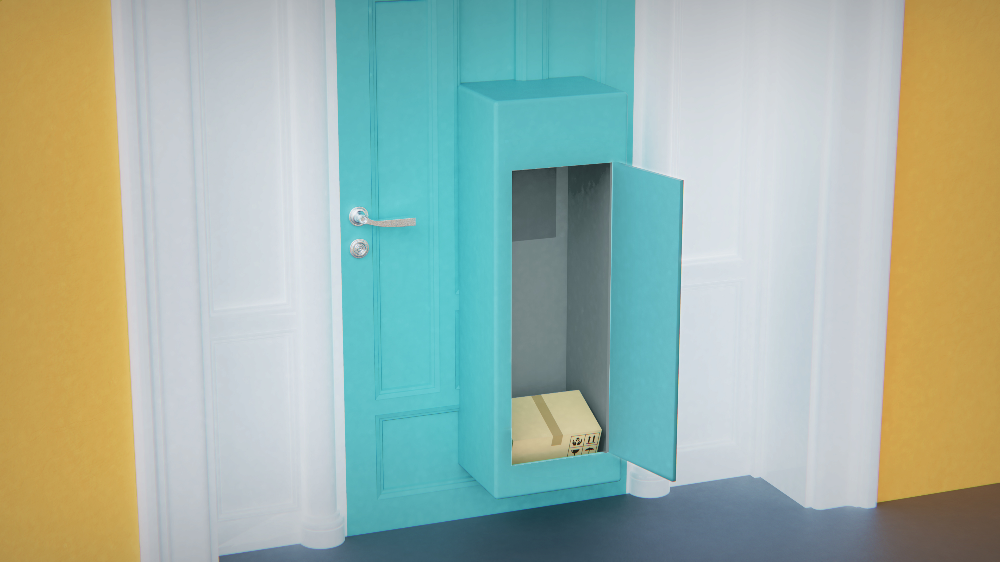
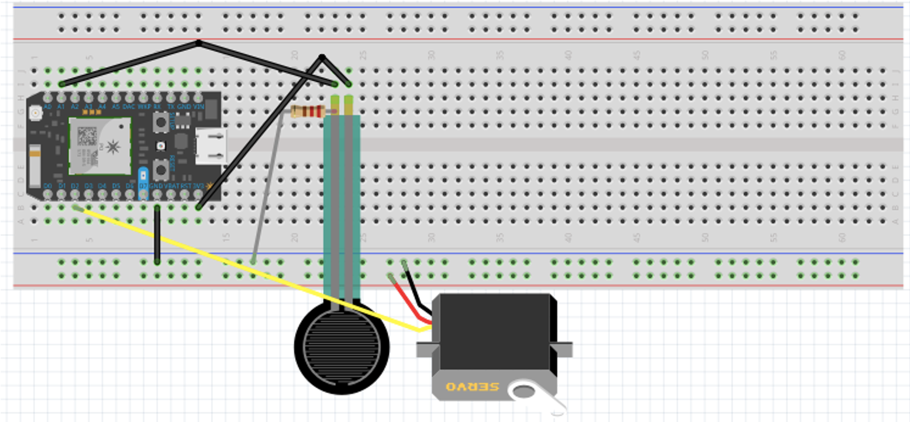

# The-Smart-Package-Storage
An IoT solution that helps receiving and storing packages remotely and safely with zero social contact.

## Concept Design

## Bill of Materials
### Cabinet
- Tall boxed shelf
- Wood plank
- Foam board
- Screws
- Door hinge

### Package Slope
- Wood plank
- Screws

### The IoT System

|  # |     Name     |Part Number| Quantity | Unit Price |
|----|--------------|-----------|----------|---|
|1   |Paticle Argon                          | NA           |   1   |        $27|
|2   |Lock-style Solenoid - 12VDC            | 1512         |   1   |     $14.95|
|3   |Load cell                              | NA           |   1   |         NA|
|4   |Circuits                               | NA           |several|         NA|

## Functional Specification

Step 1: User installing the Smart Package Storage in the door of their residence. 

Step 2: User connecting the Smart Package Storage to their smart home application or register it with their cellphone. 

Step 3: When the package is delivered to their Smart Package Storage and a image of the package is sent to the user, the user comfirm and approve to accepet the package. Their approval will send a signal to the system and thus opens the door of their Smart Package Storage to receive and store their package in the storage. 

Step 4: User can open the Smart Package Storage and take out their packages at their convenience. 

## Product Backlog
### System steps
- load cell sensor senses item(s) placed on the package slope
- camera takes picture of the item(s) on the package
- image sent to the user via text or smart home application message
- lock of the storage door unlock after user's approval signal and item(s) slide in the cabinet

### Others
- storage cabinet build up
- circuit connected
- functional and usability test
- product polished

## Prototype
### Circuit

### Code
[The Smart Package Code](The-Smart-Package-Storage/smartpackagestorage.ino)

### How it works
[Video of the Project](https://youtu.be/ta2-8CUAebI)

## Next Steps
During the 7 weeks agile process, I am glad to create, out of zero, a project that solves the problem bothering millions of people in the US. To move on further with the project, the following are my next steps:
- Investigate more about the residential stype and accommodation type of US households to make the project scalabe
- Measure the size of packages in order to indentify the adequate size of the project
- Create more value/function to the project to increase people's willingness to install
- Connection with smart home devices to create a well-round ecosystem
